# Team LLM API

给小伙伴们搭一个api共享中转站

一套面向 3～10 人小团队的自托管 LLM API 中转站教程与可直接部署的配置。

它使用 New API 管理成员、Token、额度和调用日志，使用 CLIProxyAPI（下文简称 CPA）接入 Codex、Gemini、Claude 等上游 Provider，并通过 Cloudflare、Nginx、PostgreSQL、Redis 和 Docker Compose 组成完整链路。


> [!WARNING]
> 本项目适合个人和小团队自用，不提供高可用或企业 SLA。当前固定的 New API `v1.0.0-rc.38` 是预发布版本，其发布说明不建议直接用于生产环境。部署前请确认相关上游服务条款，并定期生成和异地保存备份。

## 目录

- [完成后的架构](#完成后的架构)
- [这套方案解决什么问题](#这套方案解决什么问题)
- [部署前准备](#部署前准备)
- [第一步：准备 VPS 和 SSH](#第一步准备-vps-和-ssh)
- [第二步：安装 Docker 并初始化仓库](#第二步安装-docker-并初始化仓库)
- [第三步：接入域名和 Cloudflare](#第三步接入域名和-cloudflare)
- [第四步：配置源站证书和回源保护](#第四步配置源站证书和回源保护)
- [第五步：配置防火墙和安全组](#第五步配置防火墙和安全组)
- [第六步：启动全部服务](#第六步启动全部服务)
- [第七步：初始化 New API](#第七步初始化-new-api)
- [第八步：配置 CPA Provider](#第八步配置-cpa-provider)
- [第九步：创建成员和独立 Token](#第九步创建成员和独立-token)
- [第十步：连接客户端并验收](#第十步连接客户端并验收)
- [备份、恢复和升级](#备份恢复和升级)
- [常见问题](#常见问题)
- [仓库结构](#仓库结构)

## 完成后的架构

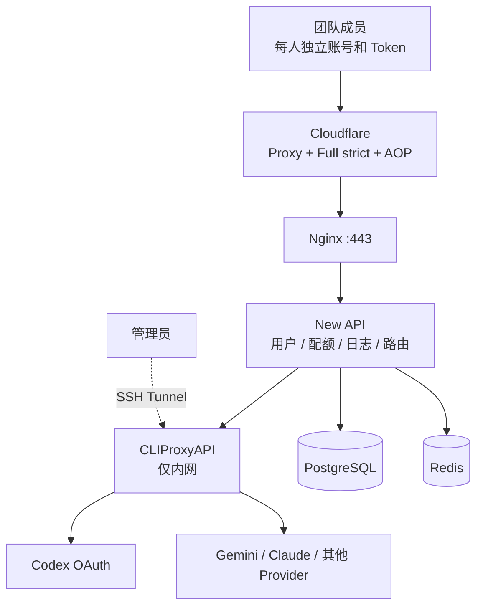

公网只发布 Nginx 的 `80/443`。CPA 的 `8317` 只绑定宿主机 `127.0.0.1`，供管理员通过 SSH 隧道访问。New API 的 `3000`、PostgreSQL 的 `5432` 和 Redis 的 `6379` 均不发布到宿主机。

## 这套方案能做什么

打通 VPS、CPA、New API、Docker、Nginx、Cloudflare 和 HTTPS。

- 每位成员使用独立 New API 账号和 Token，可单独限额、限模型、设置过期时间或禁用。
- 公开注册默认由管理员在 New API 后台关闭，Root 开启 2FA，并创建独立 Admin 日常管理。
- 所有运行密码由初始化脚本随机生成，`.env`、OAuth 凭据、TLS 私钥和备份不会进入 Git。
- 应用和基础组件使用固定镜像版本，升级前自动备份，失败后恢复旧镜像标签。
- PostgreSQL、CPA OAuth 文件、New API 数据和 TLS 文件可以整体备份与恢复。
- Cloudflare 使用 Origin CA、Full (strict) 和 Authenticated Origin Pulls（AOP）保护源站。
- README 保留完整图文流程，详细的安全和运维说明继续放在 `docs/`，便于后续 PR 和迭代。

## 部署前准备

### 推荐环境

| 项目 | 推荐值 |
| --- | --- |
| 操作系统 | Ubuntu 24.04 LTS |
| CPU | 2 vCPU |
| 内存 | 2～4 GB |
| 磁盘 | 20 GB 以上 SSD |
| 架构 | `amd64` 或 `arm64` |
| 容器环境 | Docker Engine、Docker Compose v2 |
| 域名 | 一个可以接入 Cloudflare 的域名 |


当前版本：

| 组件 | 版本 |
| --- | --- |
| New API | `v1.0.0-rc.38` |
| CLIProxyAPI | `v7.3.7` |
| PostgreSQL | `17.11-alpine` |
| Redis | `7.4.11-alpine` |
| Nginx | `1.30.5-alpine` |

### 要准备什么

开始前准备：

- 一台具有公网 IPv4 的 VPS。
- 一个域名及其域名注册商控制台权限。
- 一个 Cloudflare 账号。
- 可以连接 VPS 的 SSH 客户端。
- 计划接入 CPA 的上游账号或 API 凭据。


## 第一步：准备 VPS 和 SSH

选择离团队和上游服务网络较近的机房。价格、线路和套餐会变化.

<details>
<summary>展开：VPS 购买与控制台示例</summary>

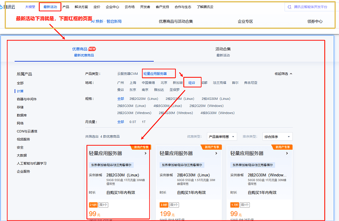

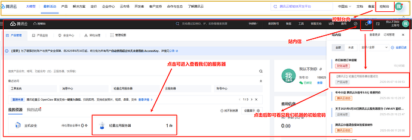

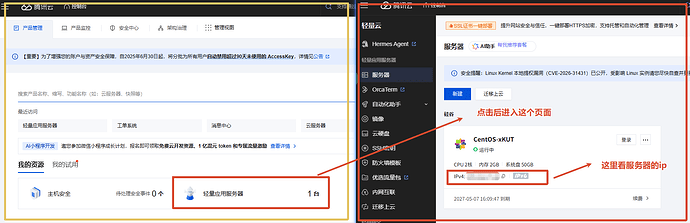

</details>

创建实例时选择 Ubuntu 24.04 LTS，并使用 SSH Key 登录。若云厂商只提供初始密码，首次登录后立即更换强密码并配置 SSH Key。

在本地连接服务器：

```bash
ssh YOUR_SSH_USER@YOUR_VPS_IP
```

Windows 可以使用系统自带 OpenSSH、Windows Terminal、FinalShell 或其他 SSH 客户端。截图中的客户端只是示例。

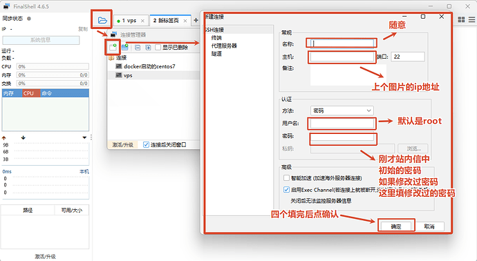

登录后先更新系统：

```bash
sudo apt update
sudo apt upgrade -y
sudo apt install -y ca-certificates curl git openssl
```

## 第二步：安装 Docker 并初始化仓库

### 2.1 安装 Docker Engine

Ubuntu 建议按 [Docker 官方 apt 仓库步骤](https://docs.docker.com/engine/install/ubuntu/)安装 Docker Engine 和 Compose v2。下面是当前官方流程：

```bash
sudo install -m 0755 -d /etc/apt/keyrings
sudo curl -fsSL https://download.docker.com/linux/ubuntu/gpg -o /etc/apt/keyrings/docker.asc
sudo chmod a+r /etc/apt/keyrings/docker.asc

sudo tee /etc/apt/sources.list.d/docker.sources >/dev/null <<EOF
Types: deb
URIs: https://download.docker.com/linux/ubuntu
Suites: $(. /etc/os-release && echo "${UBUNTU_CODENAME:-$VERSION_CODENAME}")
Components: stable
Architectures: $(dpkg --print-architecture)
Signed-By: /etc/apt/keyrings/docker.asc
EOF

sudo apt update
sudo apt install -y docker-ce docker-ce-cli containerd.io docker-buildx-plugin docker-compose-plugin
```

确认安装成功：

```bash
sudo docker version
sudo docker compose version
```

如果希望当前用户直接执行 Docker 命令：

```bash
sudo usermod -aG docker "$USER"
```

退出 SSH 并重新登录后生效。Docker 用户组等同于授予较高的主机权限，只给可信管理员使用。

### 2.2 克隆并初始化项目

```bash
git clone https://github.com/DerrickJc/team-llm-api.git
cd team-llm-api
./scripts/setup.sh api.example.com
```

把 `api.example.com` 换成你的真实 API 子域名，不要带 `https://` 或路径。

`setup.sh` 会：

1. 从 `.env.example` 创建 `.env`。
2. 随机生成 PostgreSQL、Redis、New API、CPA 密钥。
3. 渲染 `cpa/config.yaml`。
4. 创建运行目录。
5. 下载 Cloudflare 公共 AOP CA 证书。

脚本不会覆盖已存在的 `.env` 或 `cpa/config.yaml`，也不会替你创建 Cloudflare Origin 证书。

<details>
<summary>展开：原教程目录截图和本仓库的差异</summary>


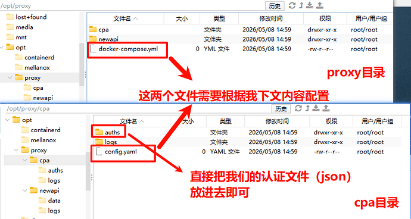


CPA 完成 OAuth 后会在 `cpa/auths/` 保存认证文件：

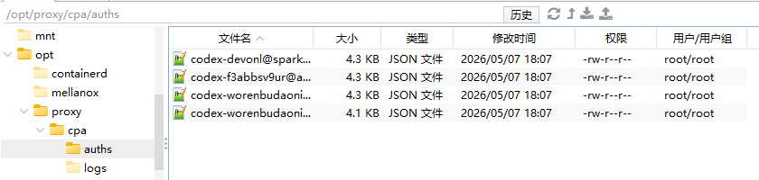

这些文件相当于账号凭据，只能进入加密备份。

</details>

## 第三步：接入域名和 Cloudflare

已经有域名可以直接从 3.2 开始。

### 3.1 购买域名

域名可以在任意支持修改 Nameserver 的注册商购买。服务商、价格和优惠随时会变化，截图只展示一般流程。

<details>
<summary>展开：原博客的域名购买示例</summary>

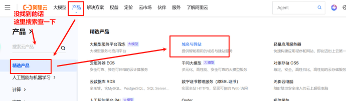

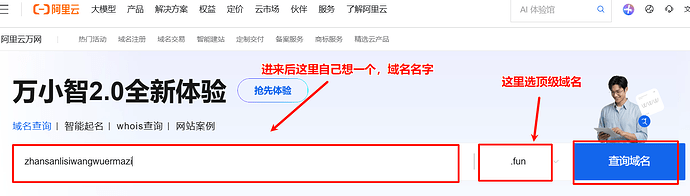

</details>

### 3.2 将域名添加到 Cloudflare

在 Cloudflare 的域名页面选择 **Add a domain / 添加域**：

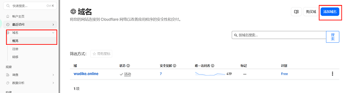

1. 登录 Cloudflare，选择 **Add a domain / 添加域**。
2. 输入根域名，例如 `example.com`，不要填 `api.example.com`。
3. 选择适合你的套餐。
4. 记录 Cloudflare 分配的两个 Nameserver。

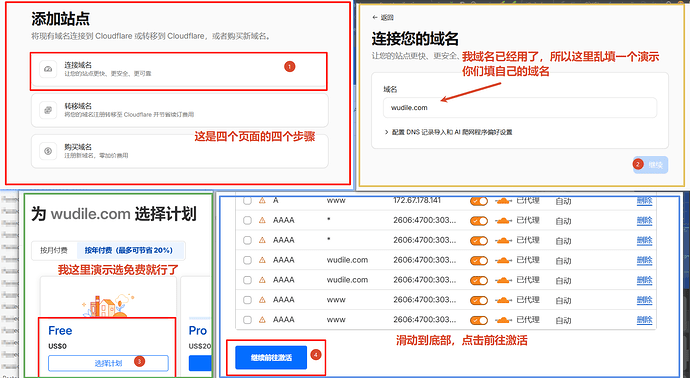

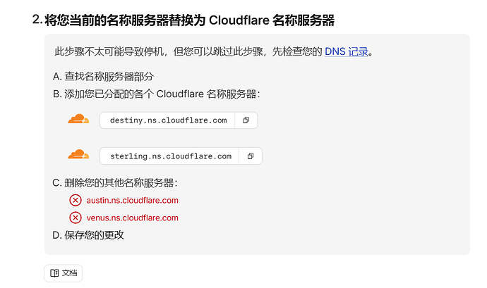

### 3.3 在注册商修改 Nameserver

回到域名注册商控制台，将原 Nameserver 替换为 Cloudflare 提供的两个地址。不要复制截图中的示例值。

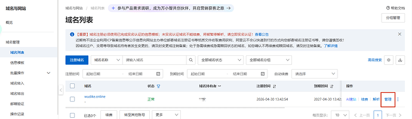

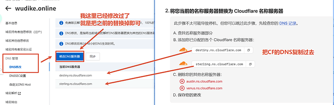

Cloudflare 检测到更新后会显示新的 Nameserver：

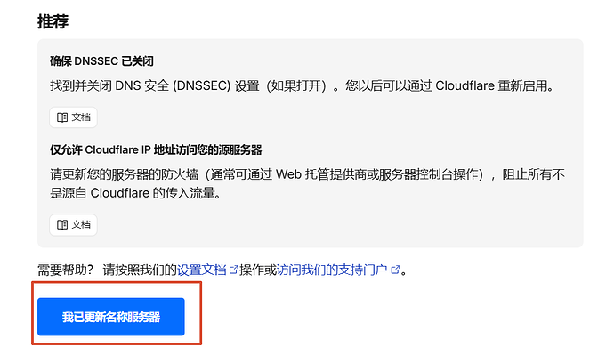

DNS 委派生效需要时间。等待页面从 Pending 变为 Active：

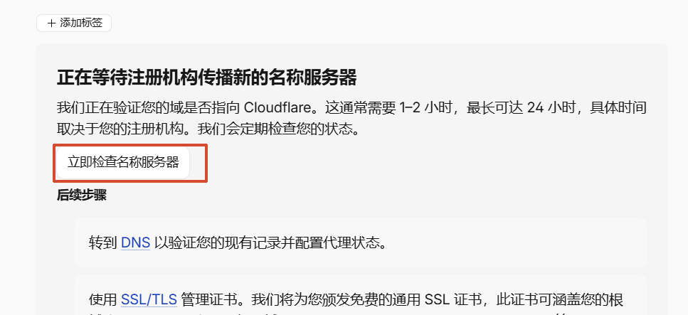

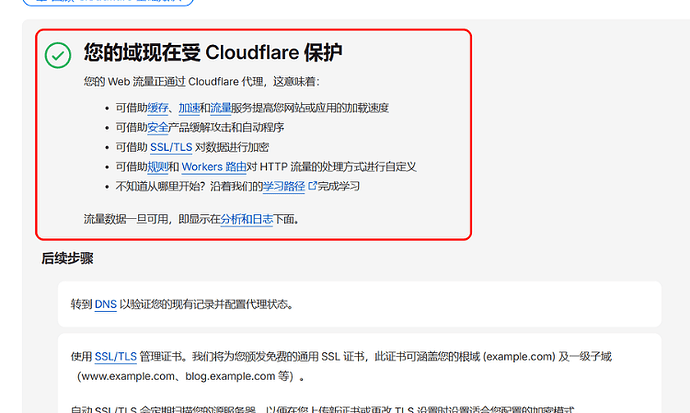

返回账户首页并进入已激活的域名：

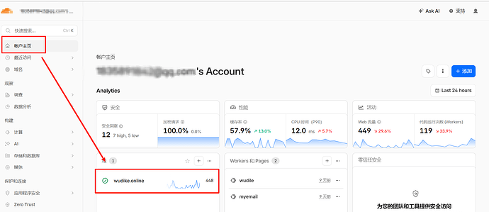

### 3.4 创建 API 子域名

进入 **DNS → Records**，添加：

| 类型 | 名称 | 内容 | Proxy |
| --- | --- | --- | --- |
| A | `api` | VPS 公网 IPv4 | 开启，橙色云朵 |

如果 VPS 没有正确配置 IPv6，不要添加 AAAA 记录。若域名不是 `api.example.com`，名称按实际子域填写。

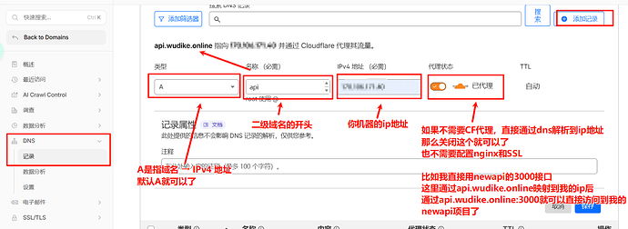

## 第四步：配置源站证书和回源保护

### 4.1 创建 Origin CA 证书

进入 **SSL/TLS → Origin Server**：

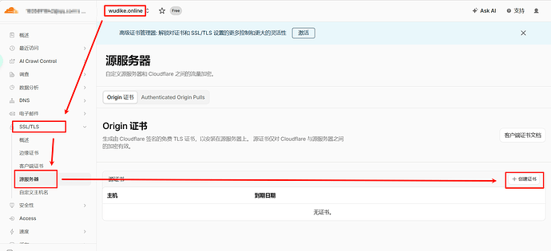

点击 **Create Certificate**：

证书主机名必须包含实际 API 域名，例如 `api.example.com`。私钥类型可以选择 ECC；有效期按你的证书轮换制度选择：

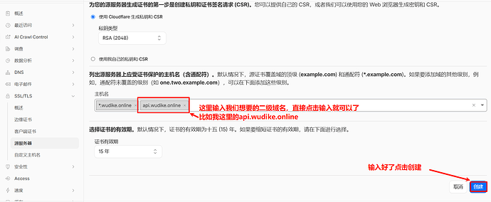

创建后页面只显示一次私钥。分别复制 **Origin Certificate** 和 **Private key**：

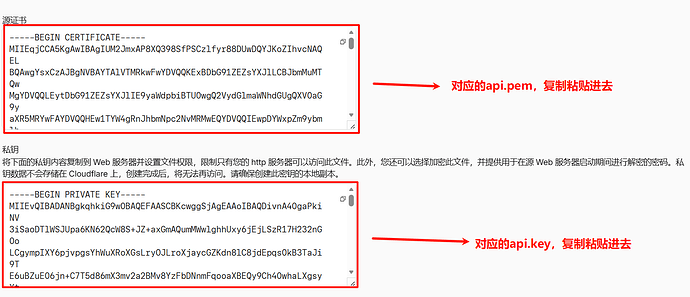

在仓库目录写入以下两个文件：

```text
nginx/ssl/origin.pem
nginx/ssl/origin.key
```

可以使用编辑器粘贴，也可以从本地通过 `scp` 上传。完成后限制私钥权限：

```bash
chmod 600 nginx/ssl/origin.key
```

Origin CA 证书只用于 Cloudflare 到源站的连接。浏览器直接访问源站 IP 时不信任该证书属于正常现象。

### 4.2 设置 Cloudflare SSL

在 Cloudflare 完成：

1. **SSL/TLS → Overview → Encryption mode** 设置为 **Full (strict)**。
2. **SSL/TLS → Origin Server → Authenticated Origin Pulls** 开启 Global AOP。
3. 为 API 主机名创建 Cache Rule，将 Cache eligibility 设为 **Bypass cache**。
4. 确认 **Network → WebSockets** 已开启。

本仓库的 Nginx 会强制验证 Cloudflare AOP 客户端证书。没有启用 AOP 时，Cloudflare 回源会失败。Cloudflare 官方文档：[Origin CA](https://developers.cloudflare.com/ssl/origin-configuration/origin-ca/)和 [Global AOP](https://developers.cloudflare.com/ssl/origin-configuration/authenticated-origin-pull/set-up/global/)。

## 第五步：配置防火墙和安全组

云安全组只需要：

| 端口 | 来源 | 用途 |
| --- | --- | --- |
| SSH 端口 | 管理员固定 IP 或 VPN 网段 | 主机管理 |
| TCP 80 | Cloudflare IP 段 | HTTP 跳转和回源 |
| TCP 443 | Cloudflare IP 段 | HTTPS 回源 |

不要开放：

- `3000`：New API，仅 Docker 网络访问。
- `5432`：PostgreSQL，仅 Docker 网络访问。
- `6379`：Redis，仅 Docker 网络访问。
- `8317`：CPA 管理端口，只绑定 `127.0.0.1` 并通过 SSH 隧道访问。


Cloudflare IP 段会变化。`scripts/sync-cloudflare-ips.sh` 用于更新 Nginx 识别真实客户端 IP 的网络列表，不会修改云安全组。安全组或主机防火墙规则需要按云厂商方式单独维护；使用前先阅读 [安全基线](docs/security.md)。

## 第六步：启动全部服务

先执行部署前检查：

```bash
./scripts/doctor.sh
```

它会检查 Docker、Compose、必填变量、占位符、证书文件、私钥权限和最终 Compose 配置。

确认无误后启动：

```bash
./scripts/start.sh
```

`start.sh` 会拉取固定版本镜像、启动服务并等待健康检查。第一次下载镜像需要几分钟。

查看服务状态：

```bash
docker compose --env-file .env ps
```

DNS 尚未生效时可以只检查容器：

```bash
PUBLIC_CHECK=0 ./scripts/start.sh
```

域名生效后再次运行：

```bash
./scripts/healthcheck.sh
```

浏览器访问：

```text
https://api.example.com
```

出现 New API 页面表示域名、Cloudflare、Nginx 和容器链路已经连通。

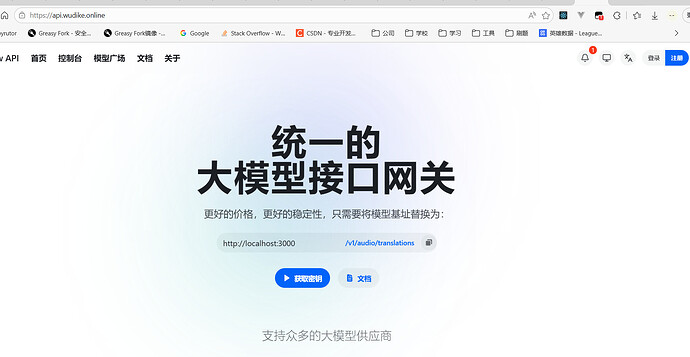

DNS 开启代理后，域名解析到 Cloudflare 边缘地址，而不是直接显示 VPS 源站 IP：

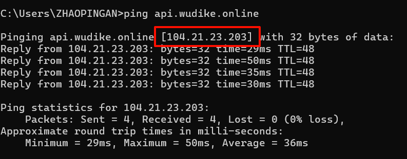

## 第七步：初始化 New API

New API 页面会随版本变化，以下截图用于识别功能位置。

### 7.1 创建 Root 并完成安全基线

首次打开页面，根据向导创建 Root 账号。随后立即执行：

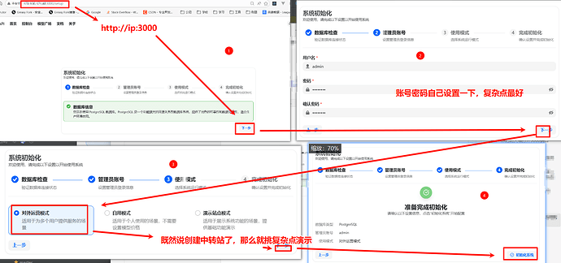

1. 设置强密码并开启 2FA。
2. 在系统设置中关闭密码注册和 OAuth 注册。
3. 创建独立 Admin 账号用于日常管理。
4. 将系统显示的服务器/API 地址设为 `https://api.example.com`。
5. 关闭签到、支付、充值等内部团队不需要的运营功能。
6. Root 只用于系统级配置，日常操作使用 Admin。

### 7.2 添加 CPA 渠道

在 **渠道 / Channels** 中新建 OpenAI 兼容渠道：

```text
Base URL: http://cpa:8317
API Key: 服务器 .env 中的 CPA_API_KEY
```

读取 CPA API Key：

```bash
grep '^CPA_API_KEY=' .env
```

该 Key 只用于 New API 到 CPA 的内部调用，不要发给团队成员。

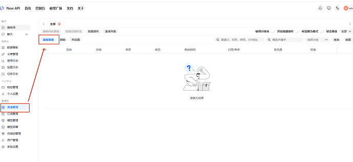

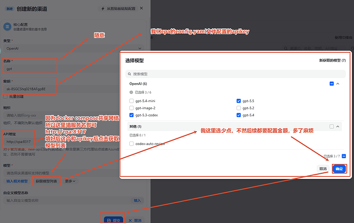

根据 CPA 已接入的 Provider 和账号选择模型。渠道测试通过前，先确认 CPA 已完成第八步的 OAuth 或凭据配置。

### 7.3 配置模型与价格

New API 需要已知的模型倍率或价格才能正确计算额度。如果页面提示缺少价格：

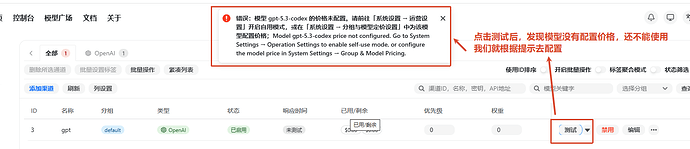

在模型或倍率设置中补充对应模型，价格以团队实际成本和 New API 当前计费单位为准：

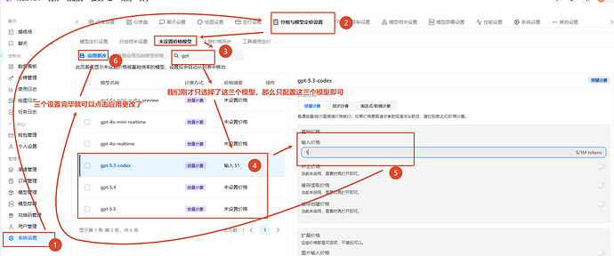

保存后测试渠道：

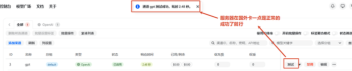

模型市场可用于确认模型是否已经被系统识别：

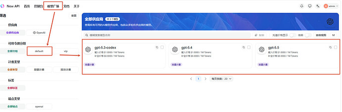

### 7.4 精简团队内部功能

根据当前版本进入系统设置：

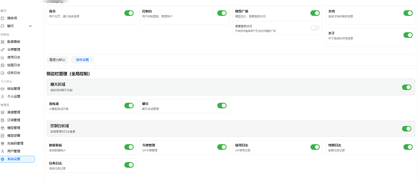

关闭签到等不需要的功能：

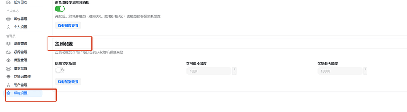

检查站点信息、公告、充值和支付相关设置：

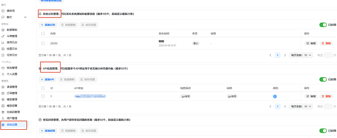

具体按钮名称可能随 New API 版本变化。团队部署的目标是保留登录、Token、额度、渠道、日志和安全设置。

## 第八步：配置 CPA Provider

CPA 管理面不经过域名公开。管理员在自己的电脑建立 SSH 隧道：

```bash
ssh -L 8317:127.0.0.1:8317 YOUR_SSH_USER@YOUR_VPS_IP
```

保持 SSH 会话，在本地浏览器打开：

```text
http://127.0.0.1:8317/management.html
```

在 VPS 仓库目录读取管理密码：

```bash
grep '^CPA_MANAGEMENT_KEY=' .env
```

登录后按 CPA 页面完成 Codex、Gemini、Claude 或其他 Provider 的 OAuth/凭据配置。认证结果会保存到 `cpa/auths/`，不得提交到 Git 或发给其他人。

完成后回到 New API 渠道页面执行测试。测试失败时按顺序检查：

1. CPA 页面对应 Provider 是否已登录且未过期。
2. New API 渠道的 Base URL 是否为 `http://cpa:8317`。
3. 渠道 Key 是否与 `.env` 的 `CPA_API_KEY` 一致。
4. 模型名称是否与 CPA 暴露的模型一致。
5. `docker compose --env-file .env logs --tail=200 cpa new-api` 是否有明确错误。

## 第九步：创建成员和独立 Token

团队成员必须一人一账号、一人一 Token：

```text
New API
├── Alice → Token A → 独立额度、模型和日志
├── Bob   → Token B → 独立额度、模型和日志
└── Carol → Token C → 独立额度、模型和日志
```

不要让所有人共用一个 Token。成员离开时应禁用该成员或撤销其 Token，不需要全员更换密钥。

建议流程：

1. Admin 手动创建 User，保持公开注册关闭。
2. 成员首次登录后修改密码并开启 2FA。
3. 成员创建自己的 API Token。
4. 为 Token 设置名称、额度、到期时间和允许模型。
5. 只有成员出口 IP 固定时才设置 IP 白名单。
6. 用极小请求测试后再发放正式额度。

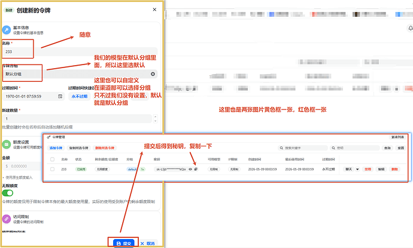

角色建议：

| 角色 | 用途 |
| --- | --- |
| Root | 系统级配置和紧急恢复 |
| Admin | 日常创建成员、配置渠道、查看整体日志 |
| User | 使用自己的 Token 调用允许的模型 |

更完整的入职、离职和 Token 轮换流程见 [团队管理](docs/team-management.md)。

## 第十步：连接客户端并验收

所有支持 OpenAI 兼容 API 的客户端通常需要：

```text
Base URL: https://api.example.com/v1
API Key:  当前成员自己的 New API Token
```

不同客户端对 Base URL 的要求可能不同：有的需要末尾 `/v1`，有的会自动补全。以客户端文档为准。

原博客使用 CC Switch 展示配置和测试：

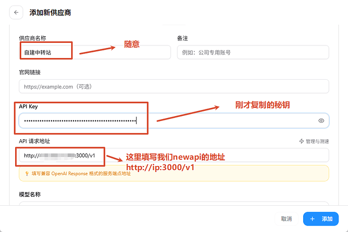

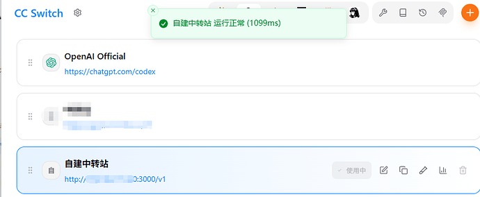

成功调用后，成员可以在 New API 查看自己的使用记录，管理员可以查看团队整体数据：

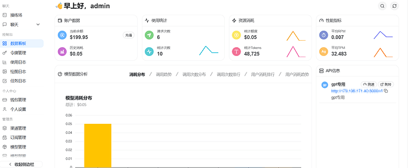

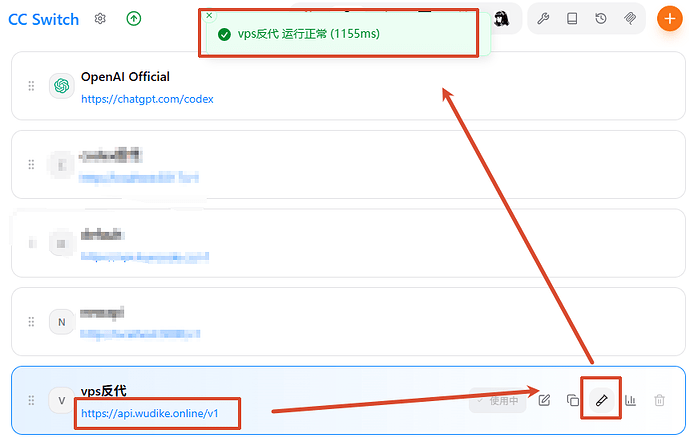

### 部署验收

在 VPS 执行：

```bash
./scripts/healthcheck.sh
docker compose --env-file .env ps
ss -lnt
```

验收标准：

- 公网域名可以通过 HTTPS 访问 New API。
- `3000`、`5432`、`6379` 不在宿主机监听。
- `8317` 只显示为 `127.0.0.1:8317`。
- 直接访问源站 IP 无法绕过 Cloudflare 正常使用站点。
- 每位成员只能使用自己的 Token 和允许的模型。
- New API 能记录成员调用和额度。
- `./scripts/backup.sh` 可以成功生成备份与校验文件。

## 备份、恢复和升级

### 日常命令

```bash
make status
make logs
make health
make backup
make restart
make stop
```

### 创建备份

```bash
./scripts/backup.sh
```

备份包含：

- PostgreSQL：用户、Token、渠道、额度、设置和日志。
- CPA 配置及 `cpa/auths/` OAuth 凭据。
- New API 数据目录。
- `.env`、Origin 证书和私钥。

备份文件本身包含全部秘密，默认保存到 `backups/` 并保留 7 天。至少再复制一份到加密的异地主机或对象存储。

### 恢复

```bash
./scripts/restore.sh backups/team-llm-api-YYYYMMDDTHHMMSSZ.tar.gz --confirm
```

恢复脚本会先生成当前环境的安全备份，然后停止请求服务、恢复数据库和文件、重新启动并执行健康检查。首次正式使用前应在测试机演练一次。

### 升级

不要直接把镜像版本改成 `latest`。阅读 New API 和 CPA Release Notes 后执行：

```bash
./scripts/update.sh --new-api v1.0.0-rc.39 --cpa v7.3.8
```

只传需要升级的参数即可。脚本会先备份，再修改固定版本、拉取镜像、启动并检查健康；失败时会尝试恢复旧标签。数据库发生不兼容迁移时仍需使用升级前备份恢复。

详细说明见 [运维手册](docs/operations.md)。

## 常见问题

### 推送 GitHub 时提示 `fetch first`

远端已有提交，先查看并整合远端历史：

```bash
git fetch origin
git log --oneline --graph --decorate --all -20
git pull --rebase origin main
git push -u origin main
```

如果本地和远端是两个无关历史，不要直接 `push --force`。先备份分支，再通过 merge 或 rebase 明确解决冲突。

### Cloudflare 显示 525、526 或源站错误

依次检查：

- `DOMAIN` 是否为真实主机名。
- DNS A 记录是否指向当前 VPS 并开启代理。
- SSL 模式是否为 Full (strict)。
- `origin.pem` 是否覆盖该 API 主机名。
- `origin.key` 是否与证书匹配且权限为 `600`。
- AOP 是否已开启。
- 安全组是否允许 Cloudflare IP 到 443。

### New API 渠道测试失败

先通过 SSH 隧道打开 CPA 管理页，确认 Provider 登录状态；再核对内部地址 `http://cpa:8317`、`CPA_API_KEY` 和模型名称。查看日志：

```bash
docker compose --env-file .env logs --tail=200 cpa new-api
```

### 非流式请求超时

Cloudflare 对回源读取有超时限制。模型客户端优先开启流式响应。本仓库已为 SSE 和长连接关闭 Nginx 代理缓冲，并配置 CPA keepalive，但无法取消 Cloudflare 套餐自身限制。

更多故障场景见 [故障排查](docs/troubleshooting.md)。

## 仓库结构

```text
.
├── compose.yaml                 # 服务编排和网络边界
├── .env.example                 # 非敏感配置模板与固定版本
├── cpa/
│   └── config.example.yaml      # CPA 配置模板
├── nginx/
│   ├── nginx.conf
│   ├── templates/               # 按 DOMAIN 渲染的站点配置
│   ├── conf.d/                  # Cloudflare Real IP 网络
│   └── ssl/                     # 本地证书，不进入 Git
├── scripts/
│   ├── setup.sh                 # 初始化秘密和运行目录
│   ├── doctor.sh                # 部署前检查
│   ├── start.sh                 # 拉取、启动并等待健康检查
│   ├── healthcheck.sh           # 服务、CPA 路由与公网检查
│   ├── backup.sh
│   ├── restore.sh
│   └── update.sh
├── docs/
│   ├── assets/tutorial/         # 原博客教程截图
│   ├── review.md                # 原方案审查与设计边界
│   ├── deployment.md            # 精简部署清单
│   ├── team-management.md       # 成员、Token 和离职流程
│   ├── operations.md            # 备份、恢复和升级
│   ├── security.md              # 安全基线
│   └── troubleshooting.md       # 常见故障
└── .github/workflows/           # PR 静态校验
```

`.env`、CPA OAuth 文件、运行配置、TLS 私钥、日志、数据和备份都已加入 `.gitignore`。提交前仍应执行 `git status`，确认没有秘密进入暂存区。

## 设计边界

该方案使用单 VPS、单 PostgreSQL 和单 Redis，主机故障会造成停机。Redis 作为可丢弃缓存，PostgreSQL 和 CPA OAuth 文件是灾难恢复核心。需要多节点、高可用、集中审计、SSO、Vault 或跨区域灾备时，应在此方案之上单独设计，不建议直接把这些组件堆进小团队第一版。

方案审查和取舍见 [docs/review.md](docs/review.md)。

## 参与维护

提交 PR 前运行：

```bash
make validate
```

版本更新应同步修改 `.env.example` 和 `CHANGELOG.md`，并在测试环境完成一次备份与恢复演练。详细约定见 [CONTRIBUTING.md](CONTRIBUTING.md)。

## 参考资料
- [Docker Engine on Ubuntu](https://docs.docker.com/engine/install/ubuntu/)
- [Cloudflare Origin CA](https://developers.cloudflare.com/ssl/origin-configuration/origin-ca/)
- [Cloudflare Authenticated Origin Pulls](https://developers.cloudflare.com/ssl/origin-configuration/authenticated-origin-pull/)
- [New API 文档](https://docs.newapi.pro/)
- [New API Releases](https://github.com/QuantumNous/new-api/releases)
- [CLIProxyAPI Releases](https://github.com/router-for-me/CLIProxyAPI/releases)

## License

[MIT](LICENSE)
