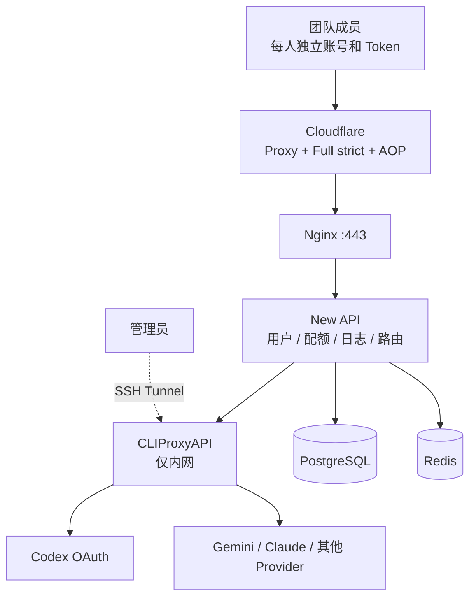

# Team LLM API
给小伙伴、小团队搭建一个api中转站的教程

面向 3～10 人小团队的单机、自托管 LLM 中转站。它把 New API 作为团队入口和配额层，把 CLIProxyAPI（CPA）作为上游 OAuth/Provider 适配层，并补齐安全默认值、备份、恢复和可控升级。

> [!WARNING]
> 本项目适合个人与小团队自用，不提供高可用或企业 SLA。当前固定的 New API `v1.0.0-rc.38` 仍是预发布版本，其官方发布说明也明确提示当前版本不推荐用于生产环境。请先确认上游服务条款，并保持可用备份。

## 架构



公网只发布 Nginx 的 `80/443`。CPA 的 `8317` 只绑定宿主机 `127.0.0.1`，用于 SSH 隧道管理；New API、PostgreSQL 和 Redis 均不发布宿主机端口。

## 已包含

- 固定并集中管理所有镜像版本
- 自动生成数据库、Redis、New API 和 CPA 密钥
- Cloudflare Origin CA、Full (strict) 与 Authenticated Origin Pulls（AOP）
- Nginx 对 SSE、WebSocket 和长响应的反向代理配置
- PostgreSQL 健康检查与依赖启动顺序
- CPA 管理面的 SSH 隧道入口
- PostgreSQL、CPA OAuth 文件、配置、证书和密钥的完整备份
- 恢复前安全备份、镜像更新失败回退、健康检查
- 适合 PR 的静态校验和 GitHub Actions

## 环境要求

推荐：

- Ubuntu 24.04 LTS
- 2 vCPU、2～4 GB RAM、20 GB 以上 SSD
- Docker Engine 与 Docker Compose v2
- 一个已接入 Cloudflare 的域名

兼容目标：Ubuntu 22.04+、Debian 12+、Rocky Linux 9+、AlmaLinux 9+，`amd64` 或 `arm64`。

当前固定版本（2026-09-19 复核）：

| 组件 | 版本 |
| --- | --- |
| New API | `v1.0.0-rc.38` |
| CLIProxyAPI | `v7.3.7` |
| PostgreSQL | `17.11-alpine` |
| Redis | `7.4.11-alpine` |
| Nginx | `1.30.5-alpine` |

这些标签均已确认同时提供 `amd64` 与 `arm64` 镜像。应用版本来源见 [New API releases](https://github.com/QuantumNous/new-api/releases) 和 [CLIProxyAPI releases](https://github.com/router-for-me/CLIProxyAPI/releases)；基础镜像来自 Docker Official Images。

## 快速部署

### 1. 初始化配置

```bash
git clone https://github.com/DerrickJc/team-llm-api.git
cd team-llm-api
./scripts/setup.sh api.example.com
```

脚本会生成 `.env` 和 `cpa/config.yaml`，并下载 Cloudflare 的公开 AOP CA 证书。它不会覆盖已经存在的配置。

### 2. 配置 Cloudflare

1. 为 `api.example.com` 创建指向 VPS 的 `A/AAAA` 记录并开启代理（橙色云朵）。
2. 在 **SSL/TLS → Origin Server** 创建 Origin CA 证书。
3. 将证书保存为 `nginx/ssl/origin.pem`，私钥保存为 `nginx/ssl/origin.key`。
4. 执行 `chmod 600 nginx/ssl/origin.key`。
5. 将加密模式设为 **Full (strict)**。
6. 在 **Authenticated Origin Pulls** 中开启 Global AOP。
7. 为该主机名创建 **Bypass cache** 规则，并确认 WebSockets 已启用。

Cloudflare 官方说明：Origin CA 可用于 Full (strict)；AOP 会要求回源请求携带客户端证书，从而阻止直接访问源站。全局 AOP 的证书由所有 Cloudflare 账户共享，更高隔离要求应使用 zone 或 hostname 级自有证书。参见 [Origin CA](https://developers.cloudflare.com/ssl/origin-configuration/origin-ca/) 与 [Authenticated Origin Pulls](https://developers.cloudflare.com/ssl/origin-configuration/authenticated-origin-pull/set-up/global/)。

### 3. 启动

```bash
./scripts/start.sh
```

脚本会检查配置和私钥权限，拉取固定版本镜像，启动服务并等待健康检查。完成后访问：

```text
https://api.example.com
```

首次进入 New API 时按页面引导创建 Root 账号。

### 4. 完成 New API 安全设置

部署完成后立即执行：

1. 为 Root 设置强密码并启用 2FA。
2. 在系统设置的认证配置中关闭密码注册与 OAuth 注册。
3. 创建一个独立 Admin 账号用于日常管理。
4. 把系统显示的服务器/API 地址设置为 `https://api.example.com`。
5. 为每位成员创建独立 User；每位成员自行创建独立 API Token。
6. 按成员设置额度、过期时间和可用模型；仅在成员出口 IP 固定时设置 IP 白名单。
7. 关闭签到、支付、充值等团队内部不需要的运营功能。

New API 官方文档确认其角色分为 User、Admin、Root，并支持 2FA、Passkey、用户配额及 API Key 管理。参见 [功能概览](https://docs.newapi.pro/en/docs/guide/feature-guide) 与 [个人安全设置](https://docs.newapi.pro/en/docs/guide/feature-guide/user/personal-setting)。

### 5. 配置 CPA Provider

在本地电脑建立 SSH 隧道：

```bash
ssh -L 8317:127.0.0.1:8317 YOUR_SSH_USER@YOUR_VPS_IP
```

打开 `http://127.0.0.1:8317/management.html`，管理密码在服务器 `.env` 的 `CPA_MANAGEMENT_KEY` 中。完成 Codex、Gemini 或其他 Provider 的 OAuth/凭据配置后，在 New API 新建 OpenAI 兼容渠道：

```text
Base URL: http://cpa:8317
API Key:  .env 中的 CPA_API_KEY
```

CPA 不应经 Nginx 或 Cloudflare 对公网开放。

## 日常操作

```bash
make status              # 服务状态
make logs                # 实时日志
make health              # 服务、CPA 路由和公网检查
make backup              # 立即备份
make restart             # 重建服务
make stop                # 停止服务
```

升级固定版本：

```bash
./scripts/update.sh --new-api v1.0.0-rc.39 --cpa v7.3.8
```

恢复备份：

```bash
./scripts/restore.sh backups/team-llm-api-YYYYMMDDTHHMMSSZ.tar.gz --confirm
```

详细流程与限制见 [运维手册](docs/operations.md)。

## 仓库结构

```text
.
├── compose.yaml                 # 服务编排与网络边界
├── .env.example                 # 非敏感配置模板和固定版本
├── cpa/
│   └── config.example.yaml      # CPA 配置模板
├── nginx/
│   ├── nginx.conf
│   ├── templates/               # 域名运行时渲染
│   └── conf.d/                  # Cloudflare Real IP 网络
├── scripts/
│   ├── setup.sh                 # 初始化密钥和运行目录
│   ├── doctor.sh                # 部署前检查
│   ├── healthcheck.sh           # 运行状态检查
│   ├── backup.sh / restore.sh   # 备份与恢复
│   └── update.sh                # 带备份和回退的升级
└── docs/
    ├── review.md                # 原方案审查与边界
    ├── deployment.md            # 完整部署步骤
    ├── team-management.md       # 成员、Token 和离职流程
    ├── operations.md            # 备份、恢复、升级
    ├── security.md              # 安全基线
    └── troubleshooting.md       # 常见故障
```

`.env`、CPA OAuth 文件、运行配置、TLS 私钥、日志、数据和备份都已加入 `.gitignore`。提交前仍应执行 `git status` 确认没有秘密进入暂存区。

## 设计边界

该方案采用单 VPS、单 PostgreSQL 和单 Redis。主机故障会造成停机，Redis 仅作为可丢弃缓存，PostgreSQL 与 CPA OAuth 文件才是恢复核心。Cloudflare 的非流式回源读取存在超时限制，模型请求应优先使用流式响应；CPA 已配置 15 秒 keepalive，Nginx 已关闭代理缓冲。当前 Cloudflare 官方默认 Proxy Read Timeout 为 125 秒，参见 [Connection limits](https://developers.cloudflare.com/fundamentals/reference/connection-limits/)。

进一步结论和原教程需要修正的点见 [方案审查](docs/review.md)。

## 参与维护

提交 PR 前运行：

```bash
make validate
```

版本更新应同时修改 `.env.example`、`CHANGELOG.md`，并在测试环境完成一次备份与恢复演练。更多约定见 [CONTRIBUTING.md](CONTRIBUTING.md)。

## License

[MIT](LICENSE)
